# Laboratorio 4 - RED 
# *Analisis, Simulacion y Protocolos de Enrutamiento*

### Autores

- Manu Joan Saharrea
- Ezequiel Marin Reyna
- Alexis Ortiz

## Índice

- [Introduccion](#introduccion)

- [Primera parte](#primera-parte)

    - [Analisis caso 1](#caso-1--node0-y-node2-se-encuentran-transmitiendo-datos-a-node5)
    - [Analisis caso 2](#caso-2--todos-los-nodos-generan-tráfico-hacia-el-node5-con-packetbytesize-e-interarrivaltime-idénticos-entre-todos-los-nodos)

- [Segunda parte](#segunda-parte)

    - [Idea algoritmo de enrutamiento](#idea-de-algoritmo-de-enrutamiento)
    - [Implementacion algoritmo de enrutamiento](#implmentacion-algoritmo-de-enrutamiento)
    - [Analisis caso 1](#caso-1--node0-y-node2-se-encuentran-transmitiendo-datos-a-node5-1)
    - [Analisis caso 2](#caso-2--todos-los-nodos-generan-tráfico-hacia-el-node5-con-packetbytesize-e-interarrivaltime-idénticos-entre-todos-los-nodos-1)

- [Conclusion de las metricas y algunas preguntas](#conclusion-de-las-metricas-y-algunas-preguntas)

- [Experencia](#experiencia-con-el-laboratorio)

## Introduccion 

En este proyecto trabajaremos analizando y creando nuestro propio algoritmo de enrutamiento sobre una red de topologia tipo anillo.

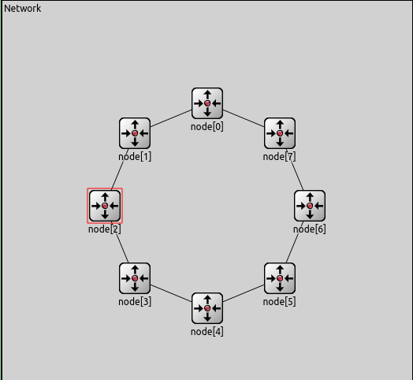

A su vez la network emplea 8 nodos con la siguiente estructura :

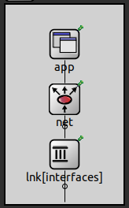

Donde cada nodo cuenta con:
 - Dos capas de enlace (link o lnk, una con cada vecino)
 - Capa de red (net).
 - Capa de aplicacion (app).

Para crear nuestro algoritmo tenemos que discutir e implementar el como la capa de red decide sobre que interface (lnk [0], lnk [1]) mandar el paquete que le llego desde la app o desde las capas de enlaces inferiores.

## Primera parte

La tarea que realizaremos en esta parte es un analisis de datos de ciertos casos que podemos visualizar en el algoritmo de enrutamiento presentado por la catedra. El mismo consiste en el: 

- **Si estamos en el nodo destino final :** Enviamos paquete a la capa de aplicacion local.
- **Si no estamos en el nodo destino final :** Re-transmitimos el paquete usando la interfaz numero 0 (Lnk[0]).

Las estadisticas que emplearemos para llevar a cabo la consigna seran : delay, buffer size y un promedio de saltos realizado por cada paquete para llegar a destino.

### Caso 1 : *Node[0] y node[2] se encuentran transmitiendo datos a node[5].*
--- 

**Buffer Size** :

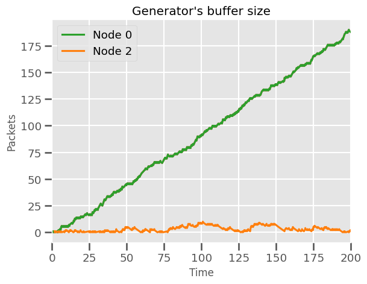

> Dentro de la foto podemos presenciar como obviamente el buffer de Node[0]Lnk[0] crece a medida que pasa el tiempo, esto sucede por que en la transmision de paquetes de Node[2], Node[0]Lnk[0] es empleado como medio para la entrega de los mismos, lo que haria que aumente ya que no envia unicamente sus propios paquetes.

**Delay** :

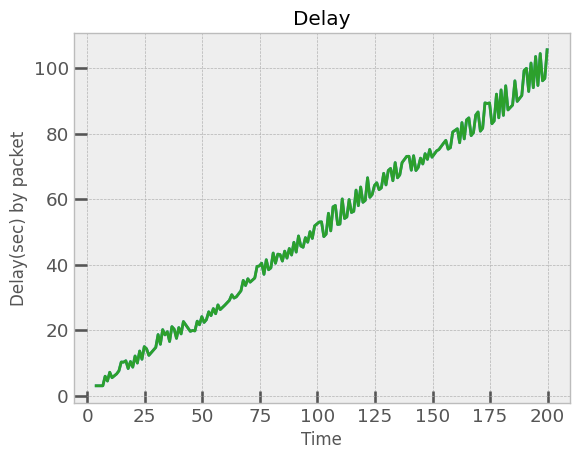

> Lo que podemos ver en esta imagen es como a medida que transcurre el tiempo, el delay producido en el envio de un paquete a destino aumenta producto del crecimiento del buffer
de Node[0]Lnk[0] ya que al llenarse, el tiempo de espera de un paquete para salir crece.

**HopCount** : 

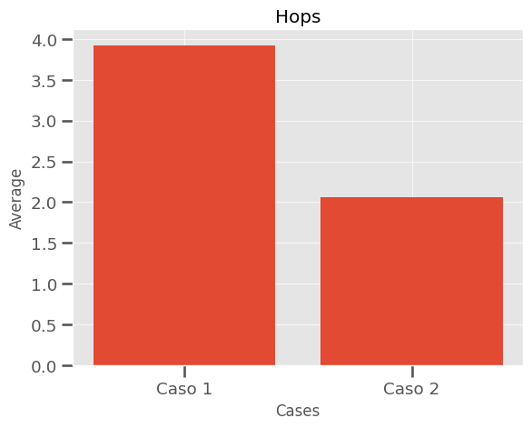

> En este caso podemos ver como el hop count se mantiene dentro del valor de 3,91... este valor es el resultado de calcular un promedio de la cantidad de saltos que se realizan por cada paquete enviado en la network. El calculo es el siguiente:
>
> **( CantidadPktSentBy2 * CantHopPktBy2 + CantidadPktSentBy0 * CantHopPktBy0 ) / CantPaquetesEmitidosTotales**

**Uso de recursos de la red** : En este caso podemos decir que es ineficiente, ya que no aprovechamos la existencia de los nodos 3 y 4 en la transmision de datos.

**¿Se puede mejorar?** : Podriamos reducir el delay producido empleando la interfaz 1 en node[2].

### Caso 2 : *Todos los nodos generan tráfico hacia el node[5] con packetByteSize e interArrivalTime idénticos entre todos los nodos.*
--- 

**Buffer Size** :

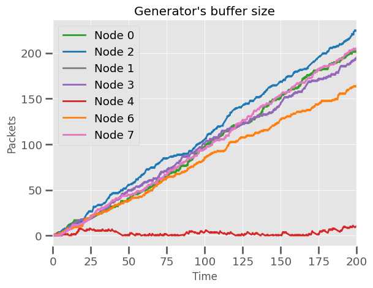

> Ahora, como todos los nodos envian paquetes, el problema que vimos en el caso 1 vuelve a suceder con todos los nodos exceptuando el 4, ya que al estar al inicio de la cadena de transmision no tiene la necesidad de re-transmitir paquetes ajenos.

**Delay** :

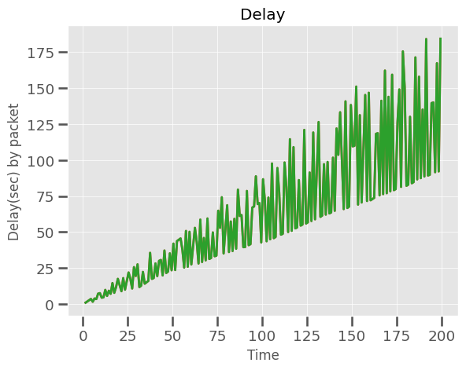

>Por la misma razon que en el caso 1, como ahora hay aun mas lineas con la necesidad de atender paquetes viejos almacenados en el buffer, el delay va a aumentar de sobre manera
como se muestra dentro del grafico.
>- Los picos maximos que podemos hallar se dan por los nodos que se encuentran mas lejos del destino, debido a que tienen mas camino que recorrer.
>- Los picos hacia abajo se dan por aquellos nodos que se encuentran mas cerca del destino, debido a que tienen menos camino que recorrer. 

**HopCount** : 

>Podemos encontrar una reduccion en el promedio de Hops en este caso, debido a que al enviar todos los nodos, nos vamos a encontrar con valores de salto de 1 hasta 7, por lo que el promedio va a decrementarse. 

**Uso de recursos de la red** : Se emplean todos los nodos, por lo tanto se aprovecha al 100% todos los recursos que brinda la network.

**¿Se puede mejorar?** : Con un protocolo de enrutamiento optimo podriamos evitar las peores situaciones como la que se da en el node[4], teniendo que ejecutar 7 saltos para llegar a destino.

## Segunda Parte

### Idea de algoritmo de enrutamiento

Para comenzar, es muy importante explicar que ***nuestro algoritmo se sostiene sobre la idea de que vamos a trabajar con networks con topologia de anillo.*** Siendo conscientes de ello, la serie de pasos que vamos a adoptar es la siguiente:

- 1. **Calculo de distancia :** Al comenzar la simulacion, por cada nodo vamos a enviar un paquete a Lnk[0] (sentido horario) y otro a Lnk[1] (sentido antihorario) a destino. Estos paquetes le avisan al destino que debe enviar al origen, por sus interfaces, paquetes que nos serviran para ver cual es la distancia entre ambos nodos. 
- 2. **Establecimiento de linea de salida :** Mediante una comparacion entre las distancias anteriormente calculadas, vamos a decidir si enviamos nuestro paquete en sentido horario, o en sentido anti horario.
- 3. **Envio de paquetes :** Una vez analizada toda nuestra informacion, vamos a enviar los mensajes que se encuentran almacenados en un buffer.

### Implmentacion algoritmo de enrutamiento

- 1. **Calculo de distancia :** En initialize dentro de Net.cc vamos a comenzar enviando los pkts mencionados para el calculo de distancia :
        - pkt_horario -> tipo 2
        - pkt_antihorario -> tipo 3

        una vez llegados a nodo destino, damos notificacion para emision de :
        - back -> tipo 4 (horario)
        - back -> tipo 5 (antihorario)

        los cuales llevan a origen la informacion de cuantos saltos (hops) fueron necesarios en esa direccion para alcanzar el nodo de interes, almacenando esa informacion en dos variables enteras privadas de la clase    
        - int hops_horario;
        - int hops_antihorario;

- 2. **Establecimiento de linea de salida :** Esto lo hacemos dentro de sendPacket(pkt) comparando hops_horario y hops_antihorario. Si la distancia yendo en dirección horaria es más óptima, mandamos por la interfaz 0; de lo contrario, por la interfaz 1. Cuando encontramos nodos enfrentados en la rueda, elegimos un camino de forma aleatoria.
- 3. **Envio de paquetes :** Para esto, creamos un Cqueue buffer, el cual se encarga de almacenar todos aquellos paquetes provenientes de la capa de aplicación o de las capas de enlaces inferiores. Una vez que hayamos calculado las mejores rutas para cada nodo, vamos a enviar los paquetes contenidos dentro del buffer por la misma empleando el metodo definido como sendPacketBuff();

### Caso 1 : *Node[0] y node[2] se encuentran transmitiendo datos a node[5].*
--- 
**Buffer Size** :

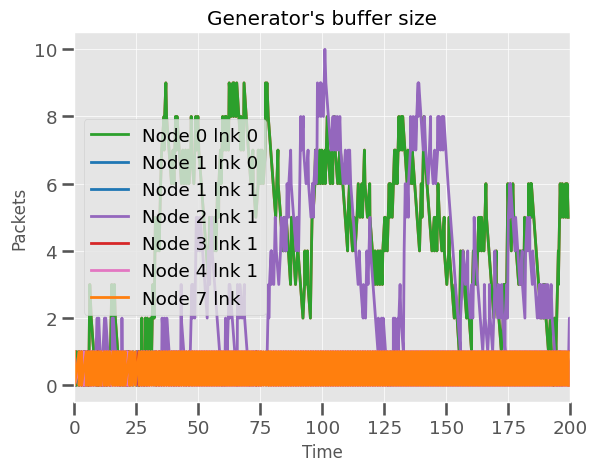

> Observando la imagen, podemos notar una clara mejora en la ocupación del buffer. Anteriormente, podíamos llegar a tener hasta 170 paquetes de información almacenados dentro de un buffer. Ahora, como se eligen de manera óptima, el nodo [2] enviará según el sentido antihorario, lo que implica que no se relacionará de ninguna forma con el nodo [0]. Por lo tanto, este último no tendrá que manejar paquetes ajenos, lo cual es beneficioso para su buffer.

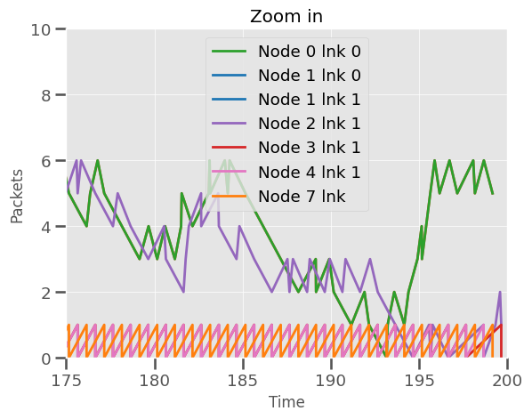

> Dentro del zoom in, podemos notar algo interesante. Como sabemos, en este caso, los nodos 3, 4, 6 y 7 no son productores, por lo tanto, aquellos paquetes que ingresen serán retransmitidos inmediatamente hacia el nodo siguiente. Por lo tanto, en el gráfico, podemos observar cómo sus buffers siempre toman los mismos valores. 

**Delay** :

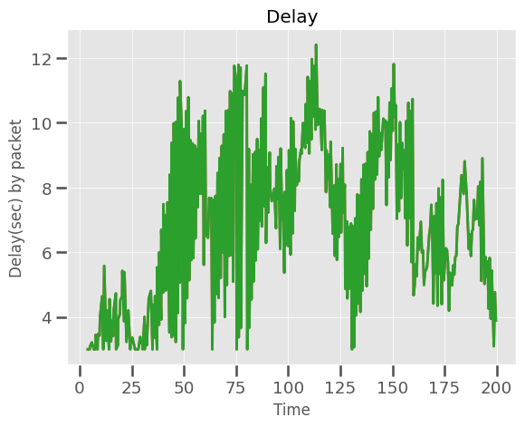

> Al nosotros dentro del algoritmo elegir las rutas mas cortas, obviamente el tiempo en el que un paquete tarda en llegar a destino va a reducirse drasticamente pasando de los 100 a los 12 segundos de espera.

**HopsCount** :

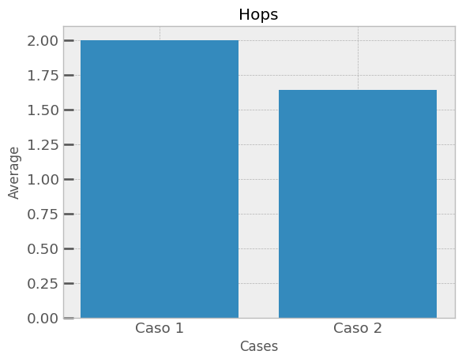

> Aqui podemos ver como el promedio de saltos se reduce en compaaracion a la parte 1, esto se da debido a que nuestra implementacion utiliza los caminos mas cortos, entonces reduce la cantidad de saltos por paquete.

### Caso 2 : *Todos los nodos generan tráfico hacia el node[5] con packetByteSize e interArrivalTime idénticos entre todos los nodos.*
--- 
**Buffer Size** :

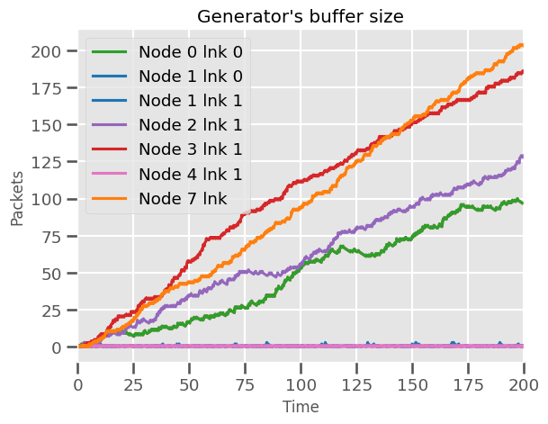

> Aquí podemos notar la diferencia en el tamaño del buffer entre los nodos que se encuentran lejos del destino y aquellos que están cerca del destino. Los nodos que se encuentran lejos, como el 2 y el 0, son los buffers menos saturados. Esto sucede porque solo pasan sus propios paquetes generados y los paquetes generados por el nodo 1.
>
>En cambio, por ejemplo, el nodo 4 maneja los paquetes generados por los nodos 3, 2 y 1, lo cual se refleja en el gráfico, mostrando la curva más alta.

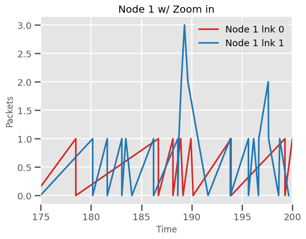

> Lo que podemos hallar en esta imagen, es un ejemplo de como se usa el ran() % 2, ya que el nodo1 al estar enfrentado al nodo5, puede avanzar por la direccion que le plazca, por lo tanto a medida que transcurre la simulacion elige ambas rutas.

**Delay** :

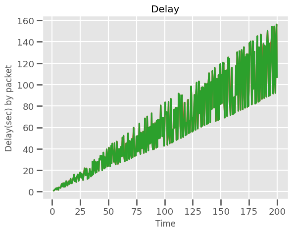

> Quiza esta sea la metrica que menos cambia entre partes, si bien hay una reduccion de al menos 10 segundos, al ser todos los nodos los que se encuentran enviando, el delay se mantendra independientemente del protocolo. 

**HopsCount** :

>Esta reducción en el promedio de saltos en el Caso 2 se debe a la inclusión de nodos que están más cerca del nodo 5, lo que permite rutas más cortas y, por lo tanto, un menor promedio general de saltos.

## Conclusion de las metricas y algunas preguntas

**¿Cuánto mejoran las métricas?**

En el primer caso, podemos ver una notable mejora en comparación con el algoritmo presentado por la cátedra. Al decidir con mejores políticas qué camino usar, ya no experimentamos un alto crecimiento en el tamaño del buffer, largas demoras en el envío de paquetes y una gran reducción en la cantidad de saltos.

Sin embargo, en el segundo caso, las métricas no se reducen tanto como en el primero. Esto se debe a la particularidad de que todos los nodos de la red generan paquetes. No obstante, algo destacable es que la cantidad de saltos realizada es inferior a la conseguida en la parte 1.

**¿Hay loops de enrutamiento?**

Dentro de el algoritmo no vamos a encontrar loops de enrutamiento, debido a que las politicas de enrutamiento que planteamos y la topologia de la red no permiten este tipo de fenomenos

**¿Ve alguna manera de mejorar más aún su diseño?**

Lo mejora que podemos hacer, seria crear un algoritmo de enrutamiento que funcione para cualquier topologia de red, implementando alguno de los vistos en la parte teorica de la materia.

## Experiencia con el Laboratorio

Fue realmente divertido de hacer, ya que nos permitieron abordar el problema de la forma en que nosotros quisiéramos. Esto nos planteó la dificultad de imaginar algún método factible de enrutamiento. Al final, logramos diseñar un sistema funcional que no solo resolvió el problema, sino que también nos permitió aprender mucho sobre la optimización de redes.